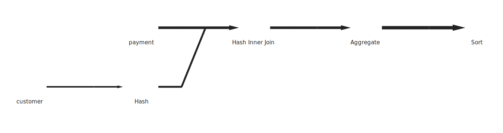
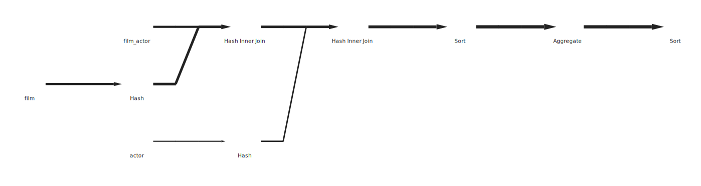
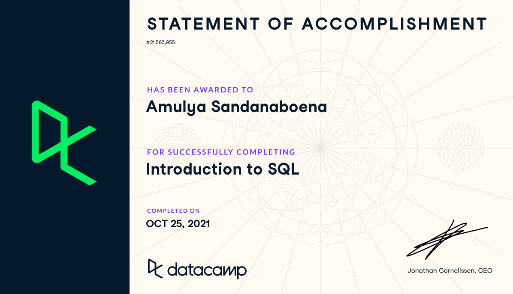
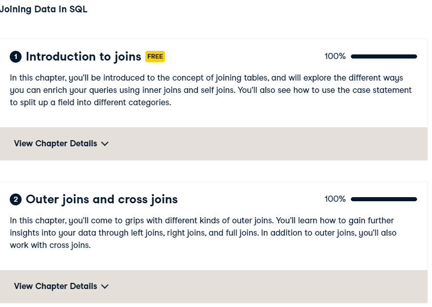

# week_06
## Week-6_Assignment_SQL_Part1
###  1.Show all customers whose last names start with T. Order them by first name from A-Z.
(a) Identify the required table from the dvdrental, to get the information of customer last names and 

(b) use the WHERE clause with wild card operator 'T%'.

#### Below is the query I used to extract to answer for the question-1:

CREATE TABLE HW_1 AS

SELECT *

FROM customer

WHERE last_name LIKE 'T%'

ORDER BY first_name ASC;

###  2.Show all rentals returned from 5/28/2005 to 6/1/2005
(a) Identify the table which has returned dates in it, then use the where clause to get the dates.

#### Below is the query I used to extract to answer for the question-2:

CREATE TABLE HW_2 AS

SELECT *

FROM rental

WHERE return_date BETWEEN '2005-05-28' AND '2005-06-01';

### 3.How would you determine which movies are rented the most?
 
STEP-1. To identify which movies are rented most, i have choosen to take three tables, (1)inventory table, (2)rental table, (3) film table
         From inventory Table and rental Table, i found the key to join both the tables as inventory_id.
		     then using inner join, i joined rental and film tables by using the key as film_id.
       
STEP-2. To get the most rented movies, i have COUNTed DISTINCT rental_id which is aliased as  rental_freq.
 
STEP-3. Finally, group by title and order by rental_freq in Descending order to get highest to least to movies rented.       
         
#### Below is the query I used to extract to answer for the question-3:

CREATE TABLE HW_3 as	

SELECT COUNT(DISTINCT r.rental_id) AS rental_freq, m.title

FROM inventory AS i

INNER JOIN rental AS r

ON i.inventory_id = r.inventory_id

INNER JOIN film as f

ON i.film_id = f.film_id

INNER JOIN movies as m

ON f.title = m.title

GROUP BY m.title

ORDER BY m.title, rental_freq DESC;
	
### 4.Show how much each customer spent on movies (for all time) . Order them from least to most.	

STEP-1. To identify how much amount each customer spent on movies, i have choosen to take customer table and payment table, and found the key to join both the 
        tables as customer_id.
        
STEP-2. using concat function i have put together both first and last names as a customer_name

STEP-3. To get the Amount spent on movies, i used aggregate function SUM to amount field in payment table as Amt_spent_on_movies.
        
STEP-4. Finally, group by customer_id and order by Amt_spent_on_movies in Ascending order to get least to highest amount, spent on movies by each customer.
        
#### Below is the query I used to extract to answer for the question-4:

CREATE TABLE HW_4 AS

SELECT concat(c.first_name, ' ', c.last_name) AS customer_name, c.customer_id, SUM(p.amount) AS Amt_spent_on_movies

FROM customer AS c

INNER JOIN payment AS p

ON c.customer_id = p.customer_id

  GROUP BY c.customer_id
  
   ORDER BY Amt_spent_on_movies ASC;
	
### 5.Which actor was in the most movies in 2006 (based on this dataset)? Be sure to alias the actor name and count as a more descriptive name. Order the results from most to least.

STEP-1. To identify Which actor was in the most movies in 2006, i have choosen to take film table, film_actor table and actor table, and found the key to join the film> film_actor is by film_id and the key to join film_actor and actor is by using actor_id.
        
STEP-2. using concat function i have put together both first and last names as a actor_name.

STEP-3. To get the count for movies, i have COUNTed DISTINCT film_id which is aliased as  movie_count.

STEP-4. to get the most movies in 2006, i used WHERE release_year = 2006 filter condition.

STEP-5. GROUP BY actor_name, actor_id, release_year and then order by movie_count in descending order to get most
        frequently rented movies in the year 2006 at the top.

#### Below is the query I used to extract to answer for the question-5:

CREATE TABLE HW_5 AS

SELECT concat(a.first_name, ' ', a.last_name) AS actor_name, actor_id, release_year, COUNT(DISTINCT film_id) AS movie_count

FROM film AS f

INNER JOIN film_actor AS fa

USING(film_id)

INNER JOIN actor AS a

USING(actor_id)

WHERE f.release_year = '2006'

GROUP BY actor_name, actor_id, release_year

ORDER BY movie_count DESC;

### 6.Write an explain plan for 4 and 5. Show the queries and explain what is happening in each one. 

Explain plan for 4:

STEP-1. To identify how much amount each customer spent on movies, i have choosen to take customer table and payment table, and found the key to join both the tables as customer_id.
        
STEP-2. using concat function i have put together both first and last names as a customer_name.

STEP-3. To get the Amount spent on movies, i used aggregate function SUM to amount field in payment table as Amt_spent_on_movies.
      
STEP-4. Finally, group by customer_id and order by Amt_spent_on_movies in Ascending order to get least to highest amount, spent on movies by each customer.
        
#### Below is the query I used to extract to answer for the question-6:

I have used the EXPLAIN with JSON format which shows a data model image

EXPLAIN (FORMAT JSON)

SELECT concat(c.first_name, ' ', c.last_name) AS customer_name, c.customer_id, SUM(p.amount) AS Amt_spent_on_movies

FROM customer AS c

INNER JOIN payment AS p 

ON c.customer_id = p.customer_id

GROUP BY c.customer_id

ORDER BY Amt_spent_on_movies ASC;

	
Explain plan for 5:

STEP-1. To identify Which actor was in the most movies in 2006, i have choosen to take film table, film_actor table and actor table, and found the key to join the film, film_actor is by film_id and the key to join film_actor and actor is by using actor_id.
        
STEP-2. using concat function i have put together both first and last names as a actor_name.

STEP-3. To get the count for movies, i have COUNTed DISTINCT film_id which is aliased as  movie_count.

STEP-4. to get the most movies in 2006, i used WHERE release_year = 2006 filter condition.

STEP-5. GROUP BY actor_name, actor_id, release_year and then order by movie_count in descending order to get most
        frequently rented movies in the year 2006 at the top.
        
EXPLAIN (FORMAT JSON)

SELECT concat(a.first_name, ' ', a.last_name) AS actor_name, a.actor_id, f.release_year, COUNT(DISTINCT f.film_id) AS movie_count

FROM film AS f

INNER JOIN film_actor AS fa 

ON fa.film_id = f.film_id

INNER JOIN actor AS a 

ON a.actor_id = fa.actor_id

WHERE f.release_year = 2006

GROUP BY  actor_name,	a.actor_id,	f.release_year

ORDER BY movie_count DESC;
    

	
### 7.What is the average rental rate per genre?
STEP-1. To identify the average rental rate, i picked category>film_category>film.

STEP-2. I found the key to join the category>film_category is by category_id, and then and found the key to 
		    join the film_category>film is by film_id.
        
STEP-3  To get the Average rental rate, i used aggregate function SUM(rental_rate) field in film table.

STEP-4. GROUP BY genre and then order by Avg_rental_rate in descending order to get most
        rented genre at the top.
        
#### Below is the query I used to extract to answer for the question-7:

CREATE TABLE HW_7 AS

SELECT c.name AS genre, AVG(rental_rate) AS Avg_rental_rate

FROM category AS c

INNER JOIN film_category AS fc

USING (category_id)

INNER JOIN film AS f

USING (film_id)

GROUP BY genre

ORDER BY Avg_rental_rate DESC;

### 8.How many films were returned late? Early? On time?

STEP1. Tables we need film >inventory>rental.

STEP2. I found key to join film >inventory is by(film_id), key for inventory>rental 
		   is by(inventory_id).
       
STEP3. In this question i find the films were classified into 3 types based on their return as Early, Late and On time,
		   for this i have used CASE WHEN and THEN condition to create a variable called return_class.
       
STEP4. using COUNT get the film_count, finally using GROUP BY and ORDER BY return_class will get the information.

#### Below is the query I used to extract to answer for the question-8:

CREATE TABLE HW_8 AS

SELECT

CASE WHEN DATE_PART('day', return_date - rental_date) < rental_duration THEN 'Early Return'

WHEN DATE_PART('day', return_date - rental_date) = rental_duration THEN 'On time'
     
ELSE 'Late Return' END
     
AS return_class,
  
COUNT(title) AS film_count
  
FROM film AS f
  
INNER JOIN inventory AS i
  
USING (film_id)
  
INNER JOIN rental as r
  
USING (inventory_id)
  
GROUP BY return_class
  
ORDER BY return_class;

### 9.What categories are the most rented and what are their total sales? 

STEP1. Tables we need category >film_category >inventory>rental >payment.

STEP2. I found key to join category >film_category is by(category_id), key for film_category >inventory 
  		 is by(film_id), key for joining inventory>rental is by inventory_id, and lastly the key for joining 
    	 rental >payment is by rental_id.
       
STEP3. select category name as genre, and i used aggregate function SUM(amount) from rental as total_sales.

STEP4. GROUP BY genre then, ORDER BY total_sales in DESCENDING order to get highest total_sales at the top.

#### Below is the query I used to extract to answer for the question-9:

CREATE TABLE HW_9 AS

SELECT c.name AS genre, SUM(amount) AS total_sales

FROM category AS c

INNER JOIN film_category AS fc

USING (category_id)

INNER JOIN inventory AS i

USING (film_id)

INNER JOIN rental AS r

USING (inventory_id)

INNER JOIN payment AS p

USING (rental_id)

GROUP BY genre

ORDER BY total_sales DESC;

### 10.Create a view for 8 and a view for 9. Be sure to name them appropriately. 

STEP1. Creating views for question 8 and 9 here, i used the CREATE VIEW SQL statment to create a view for tables 8 and 9.

CREATE VIEW films_returned AS

SELECT 

CASE WHEN DATE_PART('day', return_date - rental_date) < rental_duration THEN 'Early Return'

WHEN DATE_PART('day', return_date - rental_date) = rental_duration THEN 'On time
     '
ELSE 'Late Return' END
	
AS return_class,

COUNT(title) AS film_count

FROM film AS f

INNER JOIN inventory AS i

USING (film_id)

INNER JOIN rental as r

USING (inventory_id)

GROUP BY return_class

ORDER BY return_class;
	
#### creating a view for table 9

CREATE VIEW most_rented_and_total_sales AS	

SELECT c.name AS genre, SUM(amount) AS total_sales

FROM category AS c

INNER JOIN film_category AS fc

USING (category_id)

INNER JOIN inventory AS i

USING (film_id)

INNER JOIN rental AS r

USING (inventory_id)

INNER JOIN payment AS p

USING (rental_id)

GROUP BY genre

ORDER BY total_sales DESC;

### Bonus :
### 11.Write a query that shows how many films were rented each month. Group them by category and month. 

CREATE TABLE HW_Bonus AS

SELECT c.name AS genre, DATE_PART('Month', rental_date) AS Month_of_year,	COUNT(DISTINCT rental_id) AS film_cnt 

FROM rental AS r

INNER JOIN inventory AS i

USING (inventory_id)

INNER JOIN film AS f

USING (film_id)

INNER JOIN film_category AS fc

USING (film_id)

INNER JOIN category AS c 

USING (category_id)

GROUP BY genre, Month_of_year

ORDER BY Month_of_year;

### Explain what an RDBMS is and what SQL is briefly (under 250 words)

### RDBMS:

Data is a collection of information. To store this information and to organize this data, we need a Database. There are different types of Databases, but a few types are very important. Which includes Relational Database, NoSQL Database, Cloud Database.

RDBMS stands for Relational Database Management System, introduced by Edgar Frank Codd. RDBMS is a database management system (DBMS) that is based on relational model.

In RDBMS the data is stored in database objects, called Tables, which is a most common and simplest form of data storage in a relational database. The Table is a collection of related data entries which has constructed into many rows and columns. In Tables we call column as a Field, which is designed to keep specific information about every record, and we call Row as a Record, in which each individual entry that exists in a Table.

For Example: In DVD-rentals, we have a film table which has 13-Fields(columns) film_id, title, description, release year... and, 1000 Records (rows). 

In DVD rentals, if we want to get the information of each customer, the amount spent by each customer, along with their names. We can consider joining the two Tables i.e., customer Table and payment table and join them by using the customer_id to get their names, the amount spent by each customer, and we can also include aggregate functions to get SUM, AVG, MAX... etc.

### SQL:

SQL is a standard language which is used for storing, manipulating, and retrieving data stored in a relational database. SQL stands for Structured Query Language.

All the RDBMS like MySQL, MS Access, Oracle, Postgres…use SQL as their standard language. It has many advantages over other languages as it allows to access data in RDBMS, it allows users to define, describe, create, drop, and manipulate the data and set permissions on tables, procedures and views.

SQL has standard commands to interact with the relational databases, these commands are differentiated into groups based on their nature:

1.DDL- Data Definition Language: which includes commands like CREATE, ALTER, DROP

2.DML-Data Manipulation Language: which includes commands like SELECT, INSERT, DELETE, UPDATE.

3.DCL-Data Control Language: which includes commands like GRANT, REVOKE

###  Introduction to SQL in DataCamp

